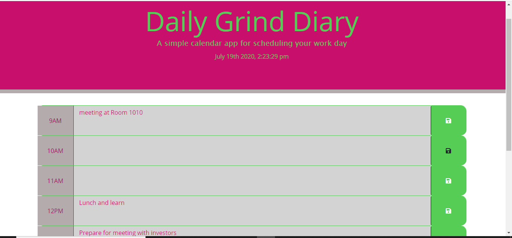

# Work Day Scheduler 

## Project Description 

A simple calendar app for scheduling your work day. 

## Technologies Used:
<ul>
<li>HTML</li>
<li>CSS</li>
<li>Bootsrap</li>
<li>Moment</li>
<li>JQuery</li>
<li>JavaScript</li>

## Functionality
<ul>
<li> The time and date appears on the app when opened to ensure the task are done on time within the hour. </li>
<li> The app has the full work day which is typically 9am to 5pm </li>
<li> User can enter the task by simply clicking into the text area and selecting the save button to ensure the task will stay on the app to review.</li>
<li> As the day progresses the time slots will change accordinng to the time day of the day. As shown in screenshot when the time has past the slots will appear gray. The present hour will appear green.The future time slots will appear in magneta.<li>

